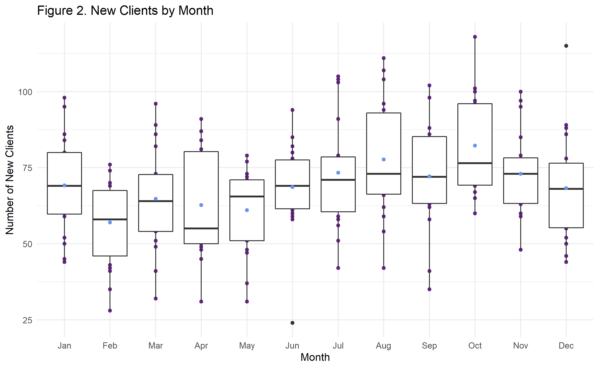
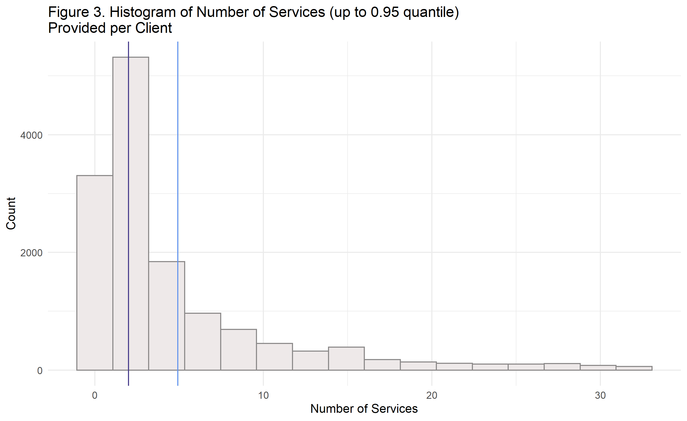
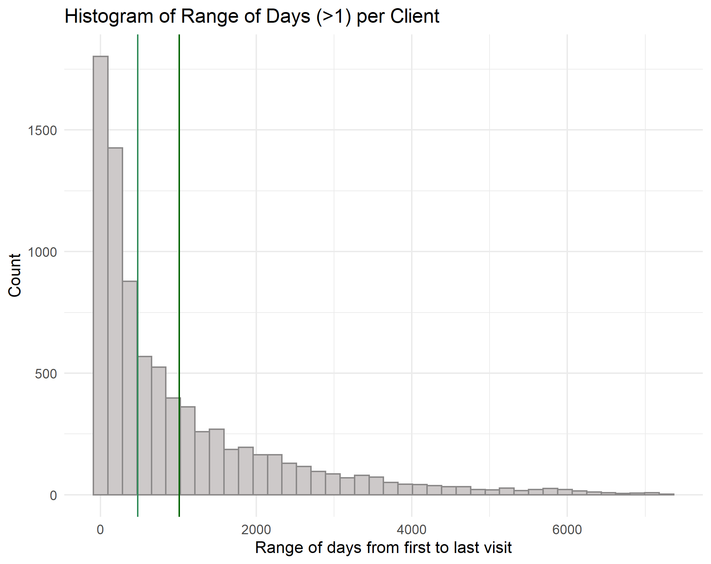
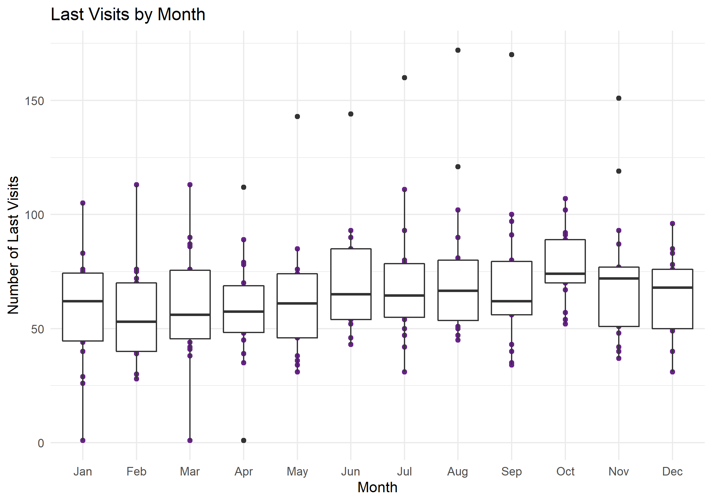
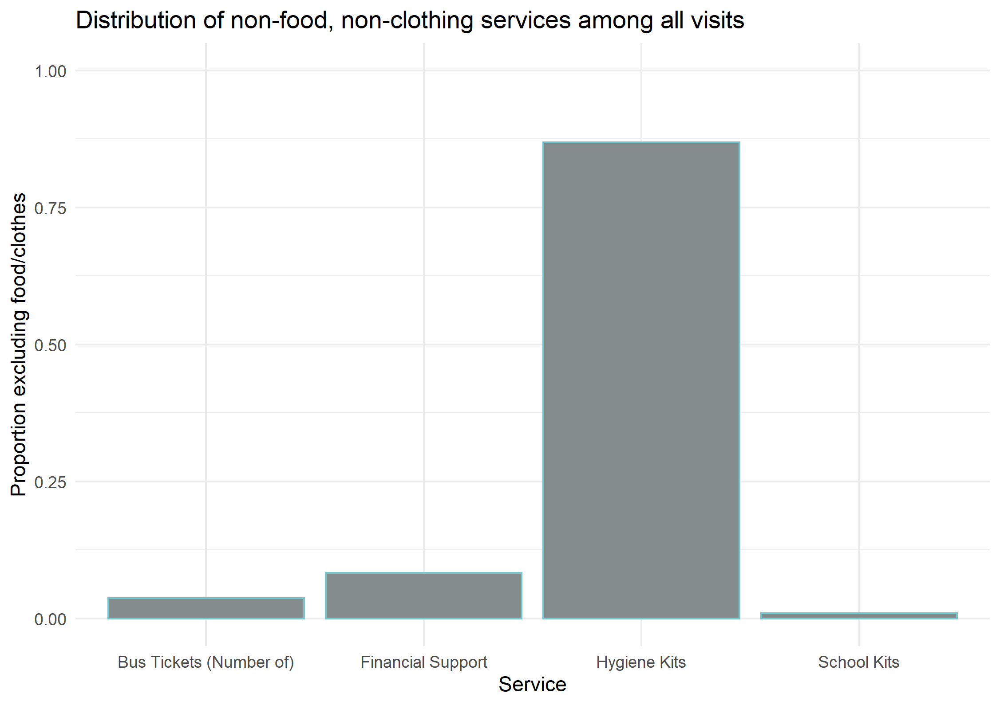
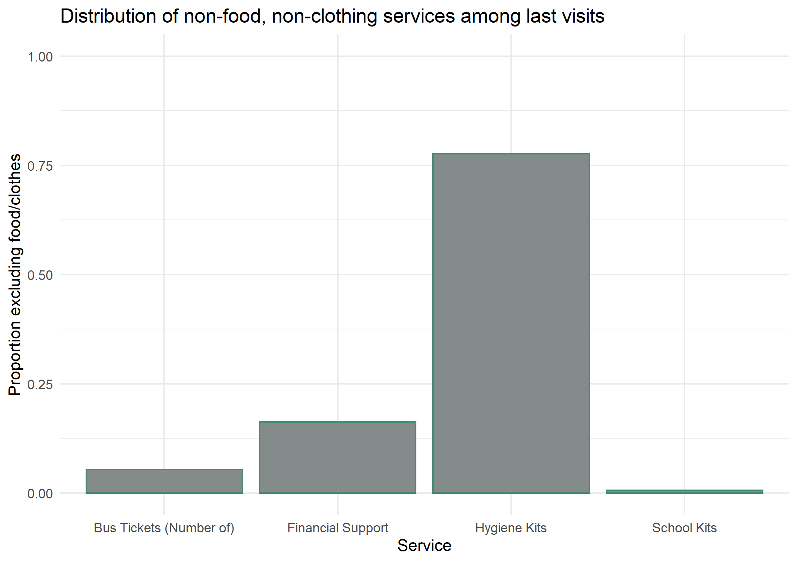

### Project 1: Urban Ministries Durham
##### Monica E. Borges for BIOS 611

##### Goals of this analysis:
* To describe the growth that UMD has experienced in recent years
* To capture trends about when people are coming and going
* To capture visualize a need associated with increasing visitors: food supply

##### Data source
Urban Ministries Durham was founded in x year and has served thousands of people in the area in efforts to combat homelessness. The source dataset for this analysis contained x records and x variables. For the purposes of this investigation, the dataset was subset to include the last two decades, for a total of x records.

##### The number of people served at UMD has grown annually.
Between 1998 and 2018, UMD has seen an overall increase in number of people served. The number of visitors from 1998 - 2002 sharply increased from x to x. Since 2002, we have seen a steadier increase, with x more total clients added over a greater stretch of time.  
   
The increase in overall visitors may be attributed to a combination of increased resources at UMD, increased awareness, and increased need in the area. 

As displayed below, the number of new clients per month is relatively constant.
,br>  
This plot displays the distribution in the number of new visitors per month over the last 20 years. For example, March averages about 60 new clients per month in the past two decades. October sees the highest number of monthly new clients, and April sees the lowest, though the overlapping box plots do not indicate a statistically significant difference. 

##### How many services do clients receieve, and how long do they "stay"?
People staying at or passing through UMD can receive several different types of services. The Number of services described in the histogram below is the number of times someone received food, clothing, bus passes, hygiene kit, school supplies, or diapers. 
    
The median number of services is 2, and the mean is 8.12. Because most clients have only 1 visit, fewer stay longer or return to UMD, so the distribution of number of services per client is skewed right.

Histogram of range of days between first and last visit

##### When do people have their last visit?

##### What happens around the last visit?
Nothing too different from other events, actually. Food is overwhelmingly important! When we take food and clothing out of the equation, there is a slight difference.  

##### Food regression line
Food pounds diestributed from the pantry and number of clients served are, perhaps unsurprisingly, closely associated. The following plot by month excludes months during which food pounds are missing from the source data. 

##### Conclusions
Urban ministries has steadily provided services
Urban ministries has momentum and is on track to continue serving DUrham individuals. It will not be surprising if food needs increase with an increase in clients. 

