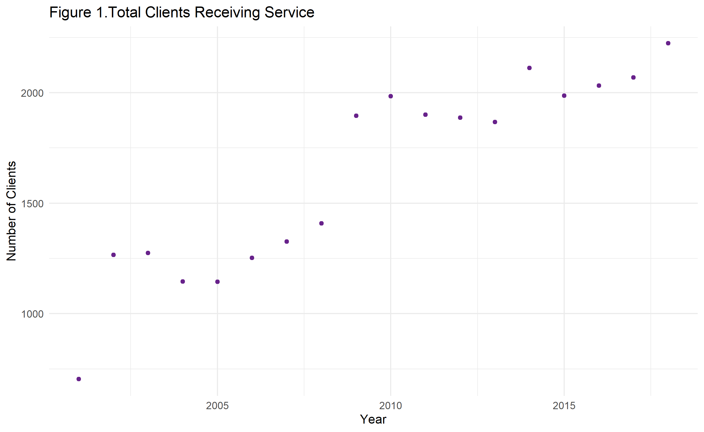
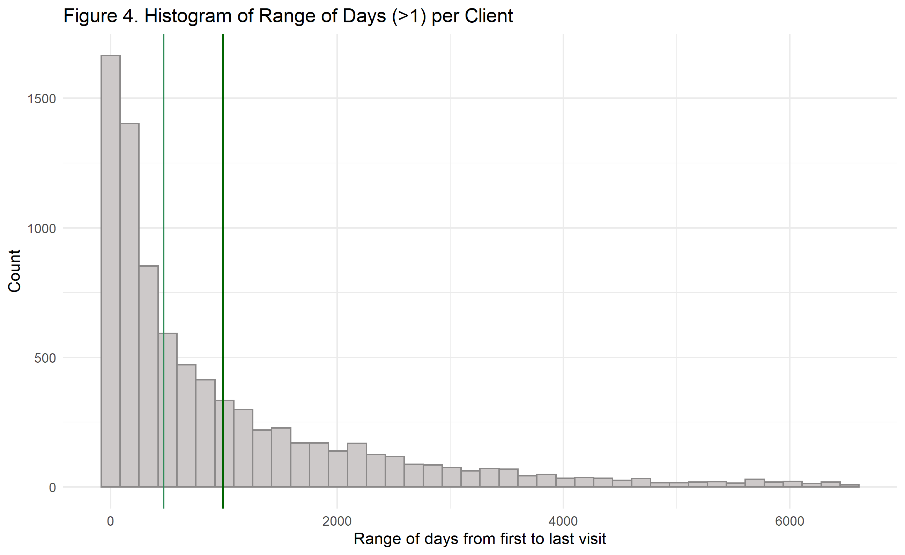

### Project 1: Urban Ministries Durham
##### Monica E. Borges for BIOS 611

##### Goals of this analysis:
* To describe the growth that UMD has experienced in recent years
* To capture trends about when people are coming and going
* To capture visualize a need associated with increasing visitors: food supply

##### The number of people served at UMD has grown annually.
Plot of increase in clients by year

Plot of new clients by month

##### How many services do clients receieve, and how long do they "stay"?

Histogram of number of 'events' per client
 

Histogram of range of days between first and last visit

##### When do people have their last visit?

##### What happens around the last visit?
Nothing too different from other events, actually. Food is overwhelmingly important! When we take food and clothing out of the equation, there is a slight difference.  

##### Food regression line
Food pounds diestributed from the pantry and number of clients served are, perhaps unsurprisingly, closely associated. The following plot by month excludes months during which food pounds are missing from the source data. 

##### Conclusions
Urban ministries has steadily provided services
Urban ministries has momentum and is on track to continue serving DUrham individuals. It will not be surprising if food needs increase with an increase in clients. 

