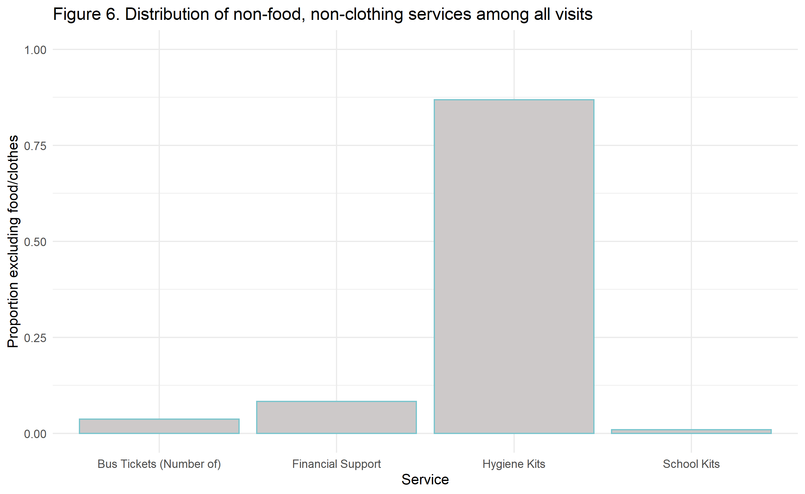

### Project 1: Urban Ministries of Durham

###### Monica E. Borges, BIOS 611, Fall 2019

 

##### Data source
[Urban Ministries Durham](http://www.umdurham.org/) (UMD) was founded in 1983 and has since served thousands of people in the area in efforts to combat homelessness. The source dataset for this analysis contained 79838 records and 18 variables. The purpose of this investigation was to focus on data collected since UMD has been operating as a campus. Therefore, the dataset for analysis includes information from 2001 - 2018, a total of of 75573 records.
 

##### Goals
* To describe the growth that UMD has seen in recent years, since 2001
* To capture trends about when people are coming and going throughout a calendar year.
* To illustrate a need associated with increasing visitors over time: the food supply.
 

##### The number of people served at UMD has grown annually.
Between 2001 and 2018, UMD has seen an overall increase in number of people served.In 2001, 1297 clients were recorded as being served at UMD, and 6074 people were served in the year 2018. 
   
The increase in overall visitors may be attributed to a combination of growing resources at UMD, awareness, need in the area, or more consistent data collection over the years.
 

As displayed in Figure 2, the number of new clients per month is relatively constant.
   
This plot displays the distribution in the number of new visitors per month over the last 20 years, with means plotted in blue Each point is the number of new clients seen in that month in an individual year. For example, October sees the highest number of monthly new clients, with a mean of 82.2 and median 76.5, and April sees the lowest. The overlapping box plots do not indicate a statistically significant difference between months. 
 

##### How many services do clients receieve, and how long do they "stay"?
People staying at or passing through UMD can receive several different types of services. The number of services described in Figure 3 is the number of times someone received food, clothing, bus passes, hygiene kit, school supplies, or diapers. Food services are pooled; otherwise, if a client received several services per visit (date), the services are considered distinct. 
    
The median number of services per person is 2, and the mean is 8.1. As many clients (n=6656) have only 1 recorded date where they visited, fewer stay longer or return to UMD, so the distribution of number of services per client is skewed right. This histogram is displayed up to the 0.95 quantile in order to better display the bulk of the distribution.
 

The range of days between a client's first and last visit, similarly to the number of services they seek, is skewed to the right. Figure 4 displays the distribution of the number of days between individual clients' first and last dates of service for clients with more than one date of service. 6656 clients were recorded on only one day, and 8284 were recorded as receiving services on more than one day. 

 

The range of days from first and last services is quite high for a small proportion of clients. This may be attributed to elongated consistent stays, or some returns back to UMD after weeks or months without visiting the campus.

##### During what time of year do people have their last visit at UMD?
Similarly to individuals' first visit, there is not a standout month during which people tend to have their last visit, or receive their last service.  

 
Figure 5 has 2 outliers occurring in November-December 2018. These may be current clients or those who recently left UMD, since the data cutoff used in this subset is the end of 2018. 

##### What happens around the last visit?
Compared with other instances where clients receive service, the last date is not particularly different. Food and clothing are in overwhelmingly high demand throughout. When we take food and clothing out of the equation, there is a slight difference between services given before and at a person's last visit.  

 

##### Food pounds increase steadily
Food pounds distributed from the pantry and number of clients served are, unsurprisingly, closely associated. The following plot by month excludes months during which food pounds are missing from the source data. 
 
 

##### Conclusions
Urban ministries has consistently provided services to people of Durham since its operation as a campus began in 2001, and appears to have momentum in its ability to help clients. UMD is on track to continue serving the community and paving a path out of homelessness for individuals in the future. It will not be surprising if food needs continue to increase proportionally with an increase in clients, and new clients can be expected at a relatively constant rate throughout the year.

