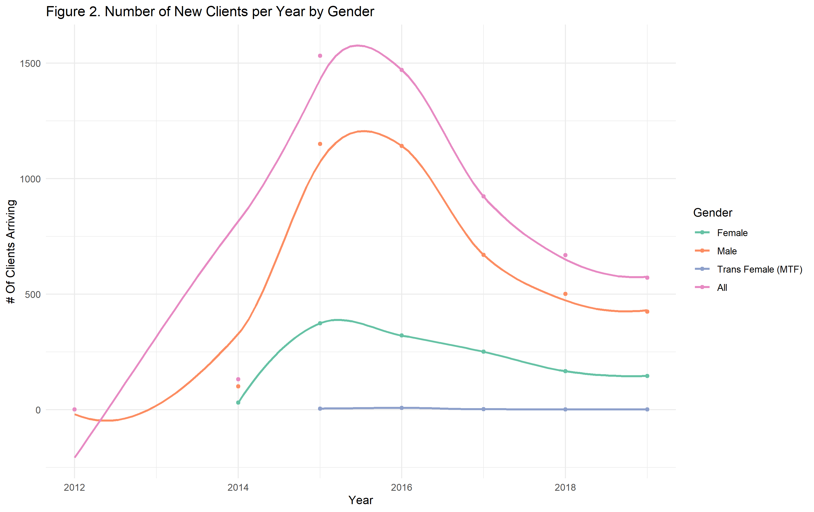
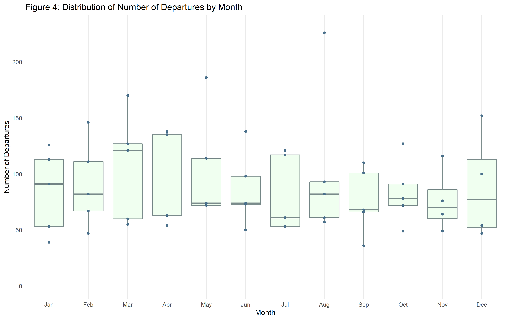
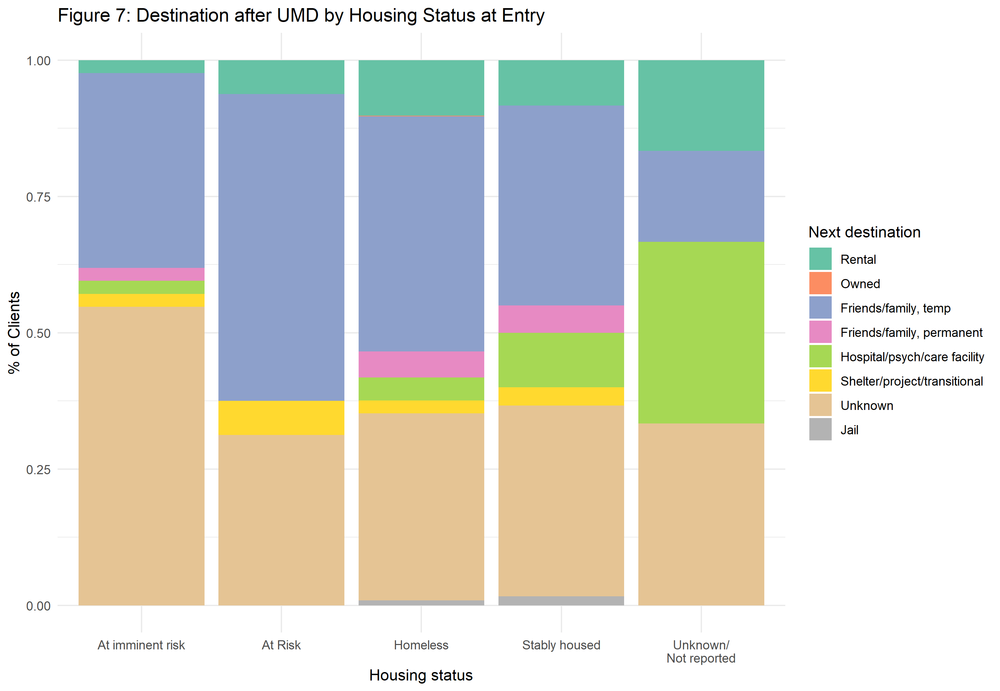

### Urban Ministries Durham Project, Part III

###### Monica E. Borges, BIOS 611, Fall 2019

### Introduction to UMD
[Urban Ministries Durham](http://www.umdurham.org/) (UMD) was founded in 1983 and has since served thousands of people in the Durham area in efforts to combat homelessness. UMD has been operating as a campus since 2008, and runs a food pantry, community cafe, gives out hygiene kits, and provides many other services to help people on a path out of homelessness. 
The data for this report pertains to the shelter at UMD. Dates range from 2012 - 2019, and several datasets were used:
* visit data included 5299 records with information about clients's entry and exit dates, where they last stayed, next destination, and more.
* demographic data included gender, race, and ethnicity
* Survey data included 5299 records and variables about

 

### Goals of this report
* To describe a big picture of the comings-and-goings-of clients at the UMD shelter
* Observe overall growth in new visitors since 2012
* Incorporate demographics from UMD and Durham to descriptive visuals
* Describe any temporal trends in client arrival and departure
* Investigate how long people stay at UMD, overall and with regard to survey results

 

#### Who is coming to the UMD shelter, and how have clients grown since 2012?
 

* The mean age when people enter the shelter is 44 years, and the median is 46 years. According to [World Population Review,](http://worldpopulationreview.com/us-cities/durham-population/#byAge) The median age in Durham in recent years, across genders, is 32. This indicates that the age distribution of UMD clients is older than that of other Durham residents.

* Male clients have a median age of 47, and female clients have a median age of 44. There are 8 different transgender clients, entering the shelter at 10 instances, and their median age is much younger: 32.5.

Since 2012, the number of new people staying at UMD increased for several years before decreasing and appearing to steady. Figure 2 displays client-flow split by gender. 

New men and women visitors increase and decrease over the same time intervals, but at different rates and in different amounts.  Because there are more men than women individuals staying at the UMD shelter, their curve more closely mirrors the "All" curve.

 

The steady increase from 2012 to 2015 may be due to increased need in the area or expanding UMD's resources and capacity since the shelter opening. 
As the number of new clients decreases, this does not indicate a decrease in number of people at the shelter--people may simply be staying longer, meaning that there is less room for new clients. Additionally, the number of new yearly clients appears to be leveling off, with a measure of 600 in 2018 and 550 thus far in 2019. 

Transgender clients appear constant over the years in comparison, likely due to the small number (N=10) of check-ins in this group.

 

#### Are some months more popular than others for new clients?

 

#### Do more people tend to leave during certain months?

 

#### Length of stay at UMD by housing status

 

#### Destination after UMD by housing status at Entry

Rental                        Owned         Friends/family, temp    Friends/family, permanent 
 478                            5                         2035                          225 
Hospital/psych/care facility Shelter/project/transitional           Unknown                         Jail 
           203                          111                         1633                           43 

