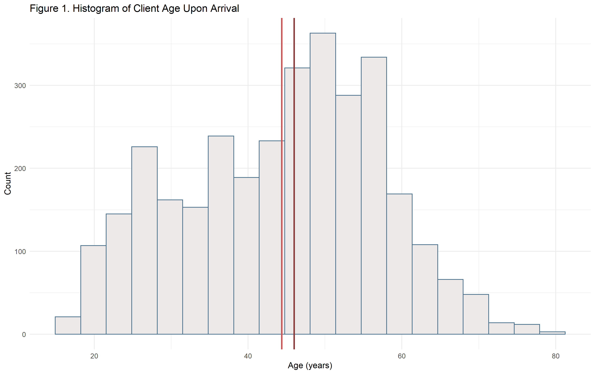

### Urban Ministries of Durham, Project III

##### Monica E. Borges, BIOS 611, Fall 2019

### Introduction to UMD
[Urban Ministries of Durham](http://www.umdurham.org/) (UMD) was founded in 1983 and has since served thousands of people in the Durham area in efforts to combat homelessness. UMD has been operating as a campus since 2008, running a food pantry, community cafe, giving out hygiene kits, and providing many other services to help people on a path out of homelessness. 
This report focuses on the shelter at UMD. Data provided are from 2012 - 2019, and several datasets were used.

* Visit data included 5299 records with information about clients' entry and exit dates, where they last stayed, next destination, and more.
* Demographic data included age at entry, gender, race, and ethnicity for each of 2364 individual clients.
* Survey data included 5299 records. Variables correspond to survey questions, such as homelessness status, and next destination after staying at UMD.
* Before creating visuals, categorical variables were binned to more clearly communicate summaries. This data cleaning included grouping together similar responses for survey questions such as housing status and next destination. 
 
 

#### Goals of this report

* To describe overall comings-and-goings-of clients at the UMD shelter
* Observe overall growth in new visitors since 2012
* Incorporate demographics from UMD and Durham to descriptive visuals
* Describe any temporal trends in client arrival and departure
* Investigate how long people stay at UMD, overall and with regard to survey results

 

#### Who is coming to the UMD shelter, and how have clients grown since 2012?
Data provided from 2012 to 2019 cover 2364 individual clients. 

 

* The mean age when people enter the shelter is 44 years, and the median is 46 years. According to [World Population Review,](http://worldpopulationreview.com/us-cities/durham-population/#byAge) the median age in Durham in recent years, across genders, is 32. This indicates that the age distribution of UMD clients is older than that of other Durham residents.

* Male clients have a median age of 47, and female clients have a median age of 44. There are 8 different transgender clients, entering the shelter at 10 instances, and their median age is much younger: 32.5.

Since 2012, the number of new people staying at UMD increased for several years before decreasing and appearing to steady. Figure 2 displays client-flow split by gender. 

New men and women visitors increase and decrease over the same time intervals, but at different rates and in different amounts.  Because there are more men than women individuals staying at the UMD shelter, their curve more closely mirrors the "All" curve.

 

The steady increase from 2012 to 2015 may be due to increased need in the area or expanding UMD's resources and capacity since the shelter opening. 
As the number of new clients decreases, this does not indicate a decrease in number of people at the shelter--people may simply be staying longer, meaning that there is less room for new clients. Additionally, the number of new yearly clients appears to be leveling off, with a measure of 669 in 2018 and 571 thus far in 2019. Transgender clients appear constant over the years in comparison, due to the small number (N=10) of check-ins in this group.

 

#### Are some months more popular than others for new clients?
As new clients come to UMD every year, it may be helpful to understand if some months are more popular than others and how to plan ahead for waves of check-ins. This is motivated by the hypothesis that seasonal weather shifts may impact community needs for shelter. For example, we might expect an uptick of entries in the winter, or for people to not leave UMD's shelter during winter months. Availability of seasonal work or other community resources could also influence housing status throughout the year.

Figure 3 includes 12 box plots, each containing the distribution of number of new clients in a month for each year since 2012. The horizontal line is the median value, and the top and bottom of each box represent the 75th and 25th percentile, respectively. Each point is the sum of check-ins at UMD during that month for a particular year. Note that If a client returns to UMD after leaving at a different date, their return entry counts as another entry.

The distributions vary in shape, and only 7 years of data are included. Median values range from 57 to 112 new clients per month. The most popular month was in August, with over 200 first visits. 
because all of the boxes overlap, we cannot conclude a significant temporal trend, indicating a relatively steady influx of clients throughout the year.

 

#### Do more people tend to leave during certain months?
Similarly to Figure 3, Figure 4 displays the distribution of departures from the shelter by month since 2012. 

Since all of the distributions represented by the box plots overlap, we cannot conclude that different months see a significantly different number of departures. Medians range from 61 average departures in July to 121 on average in March.

 

#### Length of stay at UMD by housing status
The survey data provided some background information about clients, including their housing status at the time of entering UMD shelter. The vast majority of clients are classified at "Homeless" at their time of entry to UMD. 

Figure 6 is truncated at the 95th percentile because of how far right-skewed the distribution of days spent at UMD is. The overall median length of stay at UMD is 18 days, and the mean is approximately 43 days. This indicates a right-skew, and the distribution is reflected well by the "Homeless" category in Figure 6. Each point in this figure indicates an outlier: a length of days stayed at UMD greater than the 75th percentile for a group. 

 

#### Destination after UMD by housing status at Entry

We discovered in figure 4 that clients leave UMD at a relatively constant rate throughout the year. It may be helpful to see how their next destinations are distributed , and see if we can try to predict based on housing status.

A fair portion of clients do not have associated data about where they go after leaving UMD. Temporarily staying with friends and family is the most popular next move for clients, though surprisingly prevalent among the "stably housed" category.

#### Conclusions
Understanding the comings-and-goings of past shelter clients can help UMD form expectations about the current happening and future of the shelter. Temporal or housing status trends aren't strong for client arrival, departure, and destination. However, we have an idea of how long people are likely to stay. 

* Individuals come and go relatively consistently by month throughout years over time. 
* Individuals staying at the UMD shelter tend to be a little older than the average age in Durham, and most clients are men.
* The rate of new clients visiting the UMD shelter may be leveling out, however it will take a few more years to decide if this is true. Additionally, the expansion of UMD's resources in the future might invite an uptick in clients. 
* There isn't a clear association between clients' housing status and their time spent at UMD, apart from most clients being classified as "Homeless".

